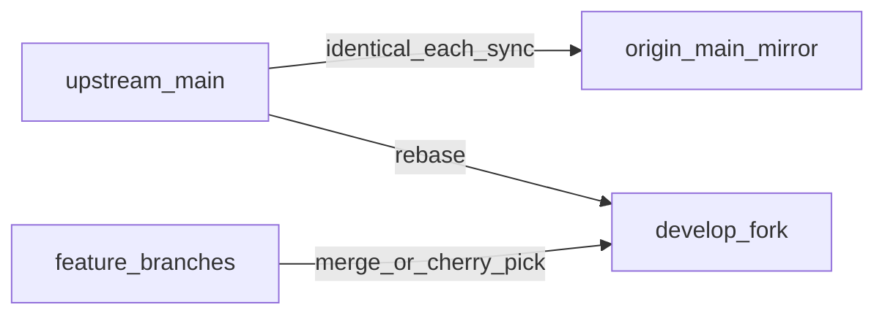

# Fork workflow: upstream, local development, and PRs

This fork tracks **[midday-ai/midday](https://github.com/midday-ai/midday)** while keeping fork-specific work on **`develop`**. On GitHub, the fork’s **default branch** is **`develop`** so new clones and default PR targets use your integration branch.

## Remotes

| Remote     | URL                                      | Role                                      |
| ---------- | ---------------------------------------- | ----------------------------------------- |
| `upstream` | `https://github.com/midday-ai/midday`    | Canonical upstream (fetch; push disabled) |
| `origin`   | `https://github.com/aculich/midday.git` | Your fork (push here)                     |

If `upstream` is missing:

```sh
git remote add upstream https://github.com/midday-ai/midday.git
git remote set-url --push upstream DISABLED
```

If you cloned your fork first and need `upstream`:

```sh
git remote add upstream https://github.com/midday-ai/midday.git
git remote set-url --push upstream DISABLED
```

## Branch roles

- **`develop`** — Default branch for **your** work: rebased onto `upstream/main` regularly, plus fork-only commits (local dev docs, scripts, experiments). Open PRs upstream from a clean topic branch or from `develop` when it contains a single coherent change.

- **`main` (on your fork)** — **Mirror of `upstream/main` only.** Each `./sync` runs `git push origin upstream/main:main --force-with-lease` so `origin/main` stays aligned with upstream. Do not keep long-lived fork-only commits only on `main`; integrate on `develop`.

  To mirror without a full `./sync`:

  ```sh
  git fetch upstream
  git push origin upstream/main:main --force-with-lease
  ```

## Daily loop: sync

From the repo root:

| Command   | What it does |
| --------- | ------------ |
| **`./sync`** | `git fetch upstream`, **mirror `upstream/main` → `origin/main`**, checkout **`develop`**, **`git rebase upstream/main`**, print upstream/develop tips and a short log of commits you are rebasing onto. |

After `./sync`, if `develop` was rebased (history rewritten), update the remote:

```sh
git push origin develop --force-with-lease
```

If `develop` only fast-forwarded:

```sh
git push origin develop
```

## Local development (this fork)

- **[docs/local-development.md](docs/local-development.md)** — minimal Midday local setup (website only or dashboard + API).
- **`./scripts/setup-local-env.sh`** — scaffold `.env` files from templates.
- **`./scripts/run-migrations.sh`** — run Drizzle against `DATABASE_SESSION_POOLER` from `apps/api/.env`.

## Upstream PRs and other branches

**`./sync` does not merge feature branches into `develop`.** Bring work in explicitly:

```sh
git checkout develop
git merge feature/your-branch    # or: git cherry-pick <sha>
```

To try an open PR from upstream without merging the branch name permanently:

```sh
git fetch upstream pull/<PR_NUMBER>/head:pr-<PR_NUMBER>
git checkout develop
git merge pr-<PR_NUMBER>           # or cherry-pick specific commits
```

## Verification after integrating upstream

From repo root (adjust to what you changed):

```sh
bun i
bun run lint    # if applicable
bun run test    # if applicable / CI parity
```

Smoke: run the stack paths described in [docs/local-development.md](docs/local-development.md).

## Publishing pull requests upstream

Target: **[midday-ai/midday](https://github.com/midday-ai/midday)** (`upstream`), base branch: **`main`** (or whatever upstream uses). Push the **head** branch to **`origin`** only.

```sh
git fetch upstream
git checkout -b fix/short-description upstream/main
# … apply commits (cherry-pick from develop, etc.)
git push -u origin fix/short-description
gh pr create --repo midday-ai/midday \
  --base main \
  --head aculich:fix/short-description \
  --title "fix: …" \
  --body "## Summary\n…\n\n## Test plan\n…"
```

If upstream moved after you opened a PR:

```sh
git fetch upstream
git checkout fix/short-description
git rebase upstream/main
git push origin fix/short-description --force-with-lease
```

## Status and upstream delta

After a large catch-up sync, refresh **[STATUS.md](STATUS.md)** (dates, commit counts, themes) so your fork documents what changed upstream.

## Diagram


